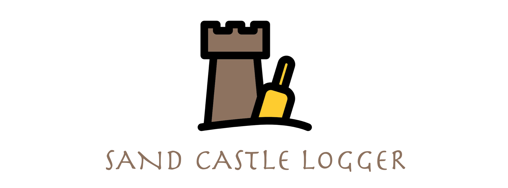

# Sand Castle Logger




## About
Sand castle logger is a simple realtime logger for your applications.

How it works:

1) Open the dashboard on your browser: <br />


2) Send a request to the api: <br />


3) View the log appears on dashboard: <br />


And that's it =).


## Install and Run
We strongly recommend you to use Docker to avoid node version errors.

### NodeJS
* Clone this repository
* Run `npm install`
* Run `npm start`
* Open `http://localhost:3000` on your browser

### Docker
* Clone this repository
* Run `sh scripts/docker/build.sh`
* Run `sh scripts/docker/run.sh`
* Open `http://localhost:3000` on your browser


## Logging

### Chose your dashboard
After you install and open dashboard on your browser, you now can send logs to it.

When you open the dashboard, realize the token param on url: `http://localhost:3000/?&t=default`.

The `t=default` is customizable. You can set new value like `http://localhost:3000/?&t=potato`. It allow you to have multiple dashboards listening different namespace logs.

The name of this parameter is `namespace token`.

### Send logs to api
After you chose your dashboard (or chose to use `default`), just send a `POST` request to `http://localhost:3000/api/log/{namespace token}`.

The body of the request must be:
```json
{
	"metadata": {
		"title": "your log title",
		"type": "type of the error",
		"icon": "font awesome icon"
	},
	"body": {}
}
```

When:
* `metadata.`
    * `title`: the title of the log.
    * `type`: the type of the log (`error` | `info` | `success`)
    * `icon`: any [Font-Awesome](http://fontawesome.io/icons/) icon.
* `body`: any `json object` you want to log.


**Ex:** <br />
Dashboard URL: `http://localhost:3000/?&t=my-awesome-app`

API Request:<br />
`POST http://localhost:3000/api/log/my-awesome-app`
```json
{
	"metadata": {
		"title": "/api/users/test",
		"type": "error",
		"icon": "fa-bug"
	},
	"body": {
		"error": "internal_error",
		"error_description": "unable to connect to database."
	}
}
```


## Thanks To
**Icon:** <div>Icons made by <a href="http://www.freepik.com" title="Freepik">Freepik</a> from <a href="https://www.flaticon.com/" title="Flaticon">www.flaticon.com</a> is licensed by <a href="http://creativecommons.org/licenses/by/3.0/" title="Creative Commons BY 3.0" target="_blank">CC 3.0 BY</a></div>

## Release Notes

### 1.0.0: First release